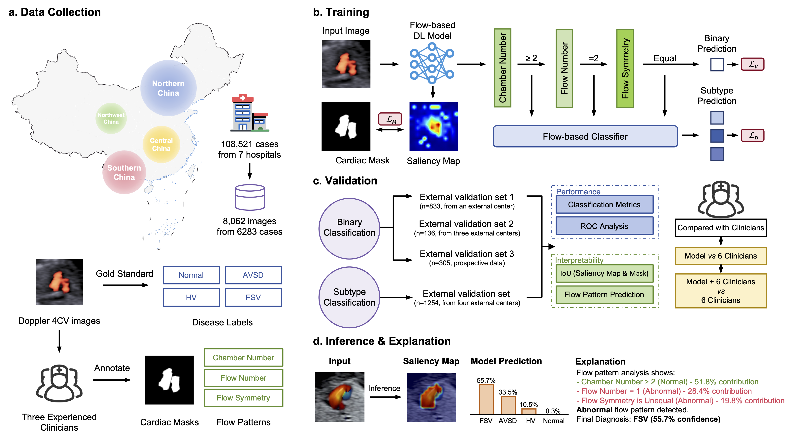

# FTCHD
An interpretable deep learning model for first-trimester fetal cardiac screening.


## Abstract
Effective first-trimester screening for congenital heart disease (CHD) remains an unmet clinical need, hampered by technical limitations and the absence of validated diagnostic tools. To address this, we collected a vast cohort of 108,521 first-trimester cardiac screenings conducted across multiple regions in China, from which 8,062 Doppler flow four-chamber view images were selected. Using this curated dataset, we developed and validated an interpretable deep learning (DL) model that mimics clinical reasoning with diastolic flow patterns, providing accurate and explainable CHD diagnosis in first-trimester. Interpretability analyses confirmed its diagnostic logic strongly aligns with clinical expertise. In rigorous evaluations, the model demonstrated high accuracy across multiple external validation datasets, matched or surpassed experienced clinicians, and showed potential to augment their diagnostic capabilities. To our knowledge, this is the first validated interpretable DL system for first-trimester CHD screening, potentially enabling earlier intervention through an advanced diagnostic window.

## Env
Recommended environment:
- python 3.12.4
- pytorch 2.4.0
- torchvision 0.19.0
- lightning 2.4.0
- transformers 4.52.3

See `pyproject.toml` for more details. If you are using pixi, simply run:
```bash
pixi i && pixi shell
```
